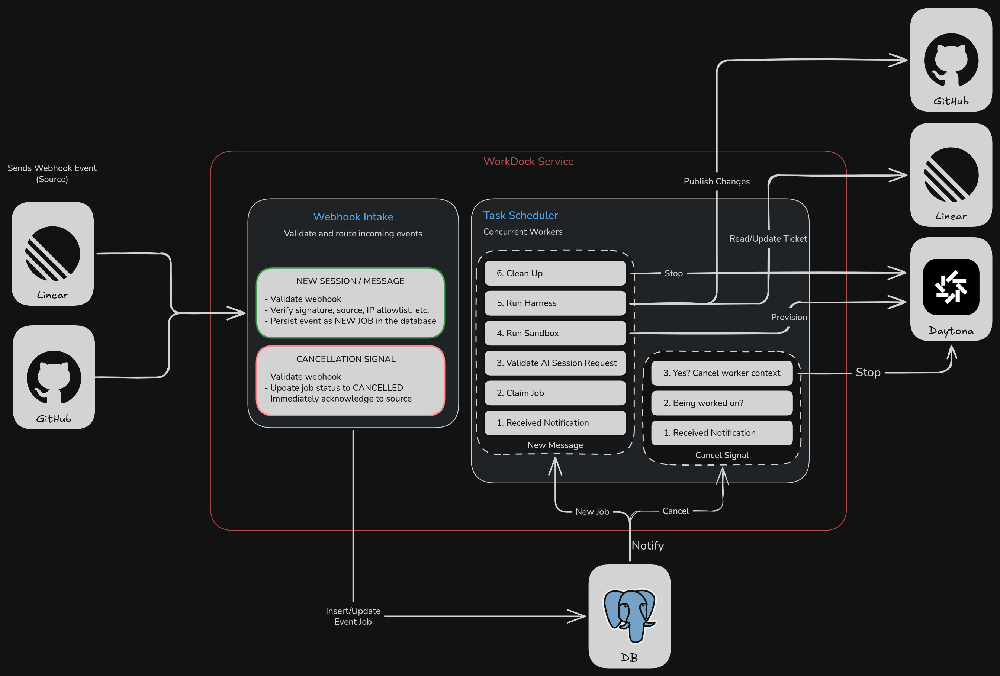

# WorkDock

> [!NOTE]
> **WorkDock is currently under active development.** Features, APIs, configuration, and integrations are subject to change as the project evolves.

WorkDock is an open-source SDLC orchestration engine for shipping software with AI agents, using the tools and workflows your team already has.

WorkDock connects your issue tracker, Git provider, coding harness, and sandbox to coordinate the development workflow end to end. It is built for the practical realities of parallel agent work: every agent needs the right issue context, repository state, dependencies, and an isolated environment in which to work.

When an issue is assigned to WorkDock, it creates an agent session, provisions the configured sandbox, and runs the configured harness with the context needed to perform the work. Changes move through your existing Git workflow as pull requests, and review feedback can trigger the next cycle without losing the context of the original issue.



## Table of Contents

- [Supported integrations](#supported-integrations)
- [Deployment options](#deployment-options)
- [How It Works](#how-it-works)
  - [1. Receive an event](#1-receive-an-event)
  - [2. Ingest a session and enqueue a job](#2-ingest-a-session-and-enqueue-a-job)
  - [3. PostgreSQL notifies WorkDock](#3-postgresql-notifies-workdock)
  - [4. A worker claims the job](#4-a-worker-claims-the-job)
  - [5. Provision the sandbox](#5-provision-the-sandbox)
  - [6. Run the coding harness](#6-run-the-coding-harness)
  - [7. Publish the changes](#7-publish-the-changes)
  - [8. Continue through feedback](#8-continue-through-feedback)
  - [9. Cancellation](#9-cancellation)
- [Observability](#observability)
- [Roadmap](#roadmap)
- [Docker Compose](#docker-compose)
- [License](#license)

## Supported integrations

WorkDock currently integrates with the following tools. Support for more tools is planned.

| Category | Supported |
| --- | --- |
| Ticket system | [Linear](https://linear.app) |
| Git hosting | [GitHub](https://github.com) |
| Coding harness | [OpenCode](https://opencode.ai) |
| Sandbox | [Daytona](https://www.daytona.io) |

## Deployment options

WorkDock is available in two ways:

- **Self-hosted, open source** — run WorkDock on your own infrastructure and connect it to the tools you already use.
- **WorkDock Teams** — a managed experience for teams coordinating AI-driven development. [Join Waitlist](https://workdock.dev/#pricing)

## How It Works

WorkDock is a single service that coordinates the different systems involved in a development workflow. It receives events through webhooks, persists them in PostgreSQL, and uses a pool of concurrent workers to process the work. Although it is a single deployable, it can be scaled horizontally: multiple instances share the same database and coordinate through PostgreSQL notifications and lease-based job claiming.

WorkDock's model builds on three concepts:

- **Agent session** — a unit of work, such as an issue or message assigned to WorkDock, identified by its provider and originating issue.
- **Session event** — an incoming webhook event that belongs to an agent session, persisted with only its validated payload.
- **Job** — the durable unit of work queued for a session event. Workers claim and execute jobs, and PostgreSQL is the source of truth for their state.


### 1. Receive an event

Linear and GitHub send webhook events to WorkDock. For example, an event can represent:

- A new agent session or message assigned to WorkDock
- A pull request comment or review
- A cancellation request

WorkDock first validates the incoming webhook before processing it.

### 2. Ingest a session and enqueue a job

WorkDock handles events differently depending on their purpose.

#### New agent session

For a new piece of work, WorkDock:

- Validates the webhook.
- Verifies the event's signature and source.
- Normalizes the event into an agent session and its session event.
- Persists the session and its event in PostgreSQL and enqueues a job that references the event.

The database becomes the source of truth for the job and its state.

#### Cancellation

Cancellation follows a different path:

- Validates the webhook.
- Verifies the event's signature and source.
- WorkDock immediately acknowledges the cancellation to the source.
- The corresponding job is updated to CANCELLED.

The actual cancellation of an active worker happens asynchronously.

### 3. PostgreSQL notifies WorkDock

After a job or job status is written to PostgreSQL, PostgreSQL sends a NOTIFY event to the WorkDock application. WorkDock uses PostgreSQL notifications to wake its workers instead of continuously polling the database for new work.

Both new jobs and cancellation status updates can generate notifications, and each has its own dedicated channel.

Notifications alone are not enough to guarantee delivery. A PostgreSQL cron job — the `jobs-orphaned-recovery` job scheduled through [pg_cron](https://github.com/citusdata/pg_cron) — runs every five seconds as a safety net. It scans the `jobs` table for orphaned work: jobs in the `queued` or `retry` state whose next attempt time has passed, and `running` jobs whose execution lease has expired. When it finds any, it re-sends the `jobs_claimable` notification so a worker claims them. This recovers events that arrived while no instance was listening, and jobs whose worker stopped before finishing.

### 4. A worker claims the job

WorkDock contains a pool of concurrent workers.

When a worker receives a notification for a new job, it attempts to claim that job. The claim ensures that only one worker processes a given job, even when multiple workers or WorkDock instances are listening for the same notification.

Once a worker successfully claims the job, it validates the job payload and verifies that everything required for execution is available, such as Git access.

### 5. Provision the sandbox

After the job has been validated, the worker provisions an isolated development environment through the configured sandbox provider. Repository-specific environment setup defines how that repository runs in its sandbox, including the dependencies and context an agent needs to work independently.

With the current integration, WorkDock uses Daytona to create the sandbox where the development work will take place.

### 6. Run the coding harness

WorkDock then runs the configured coding harness inside the sandbox.

The harness receives the context required to work on the issue and can interact with the repository from within the isolated environment.

The current supported harness is OpenCode.

### 7. Publish the changes

Based on the issue's requirements, the harness proceeds and publishes the changes to the configured Git hosting provider.

### 8. Continue through feedback

The workflow does not necessarily end when the pull request is created.

GitHub can send new webhook events when reviewers leave comments or other relevant feedback.

Those events enter WorkDock through the same webhook intake and persistence flow.

This allows the harness to continue working on the existing task and address feedback as part of the same development workflow.

### 9. Cancellation

Cancellation is handled separately from normal job execution.

When WorkDock receives a cancellation event, it immediately records the job as CANCELLED and acknowledges the request.

PostgreSQL then notifies the service (replicas). Each replica checks whether it is currently executing the cancelled job. If it is, WorkDock cancels the worker's context.

## Observability

WorkDock is instrumented and natively exports telemetry through OTLP (OpenTelemetry Protocol). This gives you visibility into the orchestration engine, workers, execution environments, and coding harnesses, including worker activity, job results, token usage, tool calls, model distribution, runtime metrics, and failures.

## Roadmap

WorkDock is evolving from a solid foundation for individual developers into a complete platform for coordinating AI-driven software development. The path toward v1.0 is:

1. Stabilize the core integrations and make the existing workflow reliable end to end.
2. Add support for another issue tracker.
3. Introduce WorkDock Teams for coordinating work across people, agents, and environments.
4. Expand the ecosystem with more coding harnesses, Git providers, and integrations.

## Docker Compose

The included single-node Compose deployment builds WorkDock, runs database migrations before starting the engine, and starts PostgreSQL, Infisical, Redis, SigNoz, ClickHouse, ZooKeeper, and the SigNoz OpenTelemetry Collector. PostgreSQL is shared by WorkDock and Infisical through separate `workdock` and `infisical` databases.

1. Start the bootstrap script:

   ```bash
   ./scripts/docker-up.sh
   ```

   The script generates missing local deployment secrets, starts Infisical and SigNoz, and waits for both services. It writes the mounted `docker/workdock/config.yaml` and Tern configuration only after all required values are present in `.env`.

2. On the first run, the script creates `.env`, generates local deployment secrets, and stops after starting the infrastructure. Add your Linear, GitHub App, Daytona, and OpenCode values to `.env`, and place the GitHub App private key at `docker/workdock/github-app.pem`. Open Infisical at `http://localhost:8081`, create the initial administrator, project, and Universal Auth client. Add that client's ID and secret plus the project ID to `.env` as `WORKDOCK_INFISICAL_CLIENT_ID`, `WORKDOCK_INFISICAL_CLIENT_SECRET`, and `WORKDOCK_INFISICAL_PROJECT_ID`, then rerun the script:

   ```bash
   ./scripts/docker-up.sh
   ```

   The engine configuration directory is mounted read-only at `/app/config`; it is never baked into the image. PostgreSQL, Redis, ClickHouse, ZooKeeper, and SigNoz state use named volumes. SigNoz is available at `http://localhost:8082`; WorkDock exports OTLP telemetry to the internal `signoz-otel-collector:4318` endpoint.

## License

Copyright 2026 Jaziel Guerrero.

WorkDock is licensed under the [Apache License, Version 2.0](https://www.apache.org/licenses/LICENSE-2.0).

You may obtain a copy of the license in the [`LICENSE`](LICENSE) file.

Unless required by applicable law or agreed to in writing, software distributed under this license is distributed on an "AS IS" BASIS, WITHOUT WARRANTIES OR CONDITIONS OF ANY KIND, either express or implied. See the license for the specific language governing permissions and limitations under the license.
